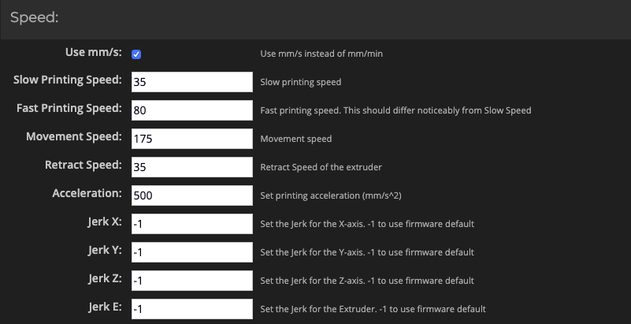
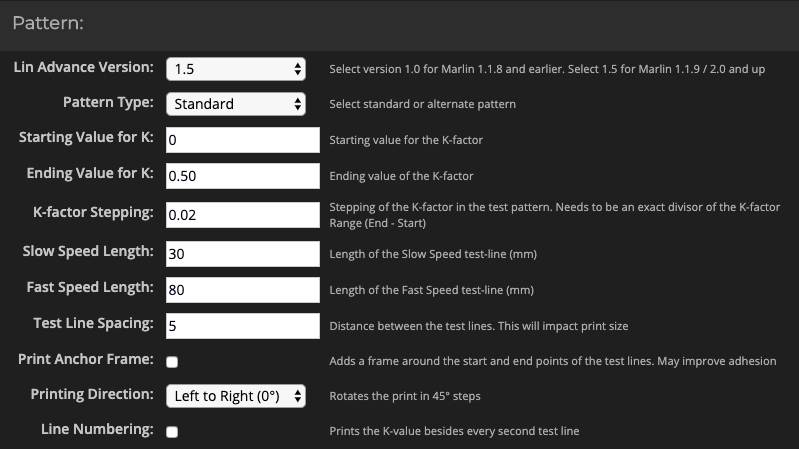

https://marlinfw.org/tools/lin_advance/k-factor.html

this is what I used. 
Some notes:
- This generator inserts hard-coded start and stop gcode so make sure it does what you want
- Unfortunately the generator just asks for the bed size, not for any offsets (in case your nozzle 0.0 is not your bed 0.0) I had to make no changes but make sure to watch your printer closely the first time you run this
- Don't print the numbers, unless you want to hate yourself while removing them from your build plate
- Add the following macro to klipper to make it work:


  
  Here's the parameters I used for the picture I posted earlier
  
#PA-Calibration with LA-Test
This is a fast calibration test for Pressure Advanced. The idea is from [FHeilmann](https://github.com/FHeilmann).


##Requirement
At first we have to add a gcode-macro to convert the M900 LA gcode to set the Pressure Advance value. Please add the following lines in your `printer.cfg`.
```
[gcode_macro M900]
default_parameter_K=0
gcode:
  SET_PRESSURE_ADVANCE ADVANCE={K}
```

##Generate Gcode
Now we use the [Marlin k-factor tool](https://marlinfw.org/tools/lin_advance/k-factor.html) to generate the gcode.
Here are my parameters I used to generate the pattern in the picture above.


Change Hotend, Bed-Temperature and Retraction-Distance.


Resize the bed to your size.


Change the Retract Speed to your Retract-Speed.


Ending Value max is 1 (Bowden). If you use a Direct-Drive printer, you can set the "Ending Value for K" to 0.25 and "K-faktor Stepping" to 0.01. If you like to print the Numbers per Line, check-in the "Line Numbering" (the numbers are horrible to remove from your buildplate).


Change the "Extrusion Multiplier" for you filament.

Fill in a Filename in the field and click on "Generate G-code". Modify the Start-Gcode on the right side and click on "Download as file".

Now print the pattern and look at which line is most constant. Count the lines from below and multiply with the "K-factor Stepping" value. This is your perfekt Pressure Advance value.